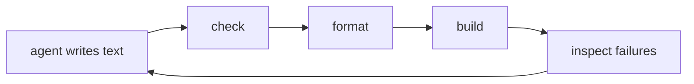
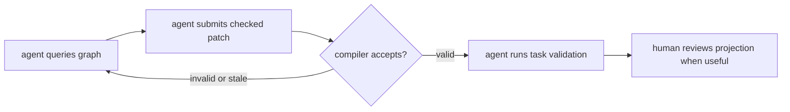

# Zerolang

**The programming language for agents.**

Zerolang is an experimental graph-native programming language where the semantic graph is the program database. Humans ask for outcomes. Agents query the graph, submit checked edits, and prove the result.

> **Safety warning**
>
> Zerolang is experimental. Expect breaking changes, rough edges, and security issues. Run it in isolated workspaces, not against production systems or sensitive data.

## Start With a Request

The expected workflow is a normal conversation:

```text
build hello world for zerolang
```

The agent should use the compiler, not guess from source text:

```sh
zero init
zero patch --op 'addMain' --op 'addCheckWrite fn="main" text="hello from zero\n"'
zero run
```

The result is still reviewable as a text projection:

```zero
pub fn main(world: World) -> Void raises {
    check world.out.write("hello from zero\n")
}
```

That `.0` file is a projection of `zero.graph`. Humans can read it, review it, and occasionally edit it. Agents should normally keep using `zero query` and `zero patch`.

## The Program Database

Traditional agent coding loops treat text as the source of truth:



Zerolang moves the agent closer to the compiler:



The graph gives agents explicit handles: symbols, node IDs, graph hashes, types, effects, ownership facts, capabilities, imports, call edges, and target facts. Edits can target semantic structure instead of line ranges. Stale graph hashes, unexpected field values, invalid shapes, and type errors fail before the store is written.

## What Exists Today

- `zero.graph` is the checked compiler input for graph-first packages.
- `.0` files are human-readable projections, not the normal agent authoring surface.
- `zero patch` applies checked graph edits and rejects stale or invalid changes.
- `zero query`, `zero inspect`, `zero check`, `zero test`, and `zero run` expose compiler facts through agent-friendly commands.
- `zero import` and `zero export` make the projection boundary explicit, so human text edits do not silently diverge from the graph.

## Install

Install the compiler:

```sh
curl -fsSL https://zerolang.ai/install.sh | bash
export PATH="$HOME/.zero/bin:$PATH"
zero --version
```

Install the agent bootstrap skill:

```sh
npx skills add vercel-labs/zerolang
```

The compiler bundles version-matched skills for agents:

```sh
zero skills
zero skills get agent
zero skills get graph
zero skills get language
zero skills get stdlib
```

## Daily Loop

For most package work:

```sh
zero query
zero patch --op help
zero patch --op 'addMain'
zero check
zero test
zero run -- <args>
```

The default input is the current directory. Use `.` only when you want to be explicit.

When a human wants to review projection text:

```sh
zero export
zero verify-projection
```

When a human intentionally edits a projection:

```sh
zero import
zero check
```

## Runtime Goals

The graph-first model should reduce agent guessing without relaxing the runtime goals:

- Token-efficient inspection
- Low memory usage
- Fast startup and builds
- Low runtime latency
- Explicit capabilities
- Small, dependency-free artifacts

## Developing Zerolang

Build the local compiler:

```sh
pnpm install
make -C native/zero-c
bin/zero --version
```

Useful checks:

```sh
pnpm run docs:build
pnpm run conformance
pnpm run native:test
pnpm run command-contracts
```

For local iteration:

```sh
pnpm run conformance:local -- --list
pnpm run conformance:local -- --shard 1/4
pnpm run command-contracts:local
```

Read the docs at [zerolang.ai](https://zerolang.ai).
